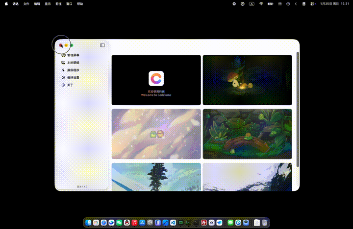

# Codelume 官方网站（Frontend）



这是 **Codelume 动态壁纸产品的官网前端项目**，目标是以更具质感与叙事性的方式，呈现 Codelume 的核心价值：

- 原生 macOS 体验
- 本地优先与隐私友好
- 多屏协同与沉浸式动态桌面

项目在保留高辨识度 `Hero` 视觉动效的前提下，围绕产品官网场景进行了结构化重构与国际化增强。

---

## 项目定位

> 一个面向产品表达与品牌传达的官方网站，而非通用模板站。

当前网站内容聚焦于：

- 产品是什么（定位与价值）
- 如何使用（流程与路径）
- 能做什么（功能与能力边界）
- 如何获取（下载与版本信息）
- 正在走向哪里（时间线与产品演进）

---

## 主要功能与信息架构

本项目已经落地并串联了以下模块（信息架构即产品叙事路径）：

### 1) Hero（品牌首屏）

- 保留并强化了原有 Hero 的视觉表现与沉浸感
- 提供清晰主 CTA（下载）与语言切换入口
- 作为整站气质锚点，强调“动态桌面 / 原生 macOS / 质感体验”

核心锚点：`<section id="hero" aria-label="Hero section">`

### 2) 作品（Creative Portfolio）

- 标题：创意作品集
- 副标题：我们支持本地任意作品私有使用
- 通过“本地素材 + 多屏播放 + 离线体验”的组合强化产品可信度

### 3) 流程（Workflow / Process）

- 从“安装 → 导入 → 分配 → 调整 → 享受”的路径呈现产品使用方式
- 保留关键标签结构，便于后续继续运营与迭代文案

### 4) 功能（Features）

- 将原服务模块语义收敛为“功能”
- 重点强调：
  - 本地 Bundle
  - 多屏控制
  - 智能暂停规则
  - 音频控制
  - 屏保模式
  - Sandbox / Offline

### 5) 下载（Download）

- 新增下载区块，以结构化表格呈现版本信息
- 同时支持：
  - App Store 跳转
  - 历史版本（Release）
  - 版本说明入口

### 6) 创意工坊（Creative Lab / Workshop）

- 从锚点切换升级为路由切换（新标签页打开）
- 当前为静态占位演示：
  - Marketplace / Editor / Publish 三段式结构
  - 为未来“素材市场 + 编辑能力”预留产品空间

路由：

- 首页：`/`
- 创意工坊：`/workshop`

### 7) 关于我们（About Codelume）

- 以“产品能力与演进”为主线，而非人物介绍
- 使用时间线（Timeline）凝练关键版本节点
- 强调稳定性、隐私性、系统行为优化等产品基因

> 团队（Team）模块已移除，避免干扰产品叙事主轴。

---

## 国际化（i18n）能力（已增强）

项目基于 `react-i18next`，并已完成从“展示型多语言”到“策略型多语言”的升级：

### 已支持语言

- English（`en`）
- 简体中文（`zh`）
- 繁体中文（`zh-TW`）
- 日本語（`ja`）
- 한국어（`ko`）

### 语言选择优先级（关键策略）

当前初始化与切换遵循“用户选择最高优先级”的原则：

1. 若用户曾主动切换语言 → 使用 `localStorage`
2. 否则 → 使用浏览器语言 `navigator.language`
3. 再否则 → 使用 `<html lang="...">`

并额外处理了地区码回退问题（如 `ja-JP` / `ko-KR` / `zh-Hant` 等），避免错误回退到英文。

---

## 技术栈

- React 18
- TypeScript
- Vite 5
- Tailwind CSS
- shadcn-ui + Radix UI
- react-i18next
- lucide-react（图标）
- React Router

---

## 关键目录结构（节选）

```text
src/
  components/
    Hero.tsx
    Portfolio.tsx
    About.tsx
    Services.tsx
    Downloads.tsx
    AboutUs.tsx
    WorkshopTeaser.tsx
    LanguageSwitcher.tsx
  pages/
    HomePage.tsx
    WorkshopPage.tsx
  i18n/
    index.ts
    config.ts
    locales/
      en/
      zh/
      zh-TW/
      ja/
      ko/
  assets/
    codelume-preview.gif
```

---

## 项目现状（可直接用于官网展示）

当前版本已经具备：

- 完整的官网叙事路径（从认知 → 能力 → 获取 → 信任）
- 多语言支持与语言策略的工程化落地
- 面向产品演进的时间线表达能力
- 创意工坊的产品位（路由级预留）

如果你要继续往“正式上线版本”推进，下一步最自然的是：

1. 补齐 `ja / ko / zh-TW` 的专业化本地化润色（术语统一与语气品牌化）
2. 将下载表格改为“配置驱动”（例如从 JSON / CMS / release feed 读取）
3. 为创意工坊添加最小可用的素材卡片与筛选交互

---

## 说明

本仓库为 Codelume 官网前端实现，强调产品表达与品牌气质统一。

如果你正在寻找的是“壁纸应用本体”，它属于另一个仓库/工程；本项目负责对外呈现与转化路径承载。
